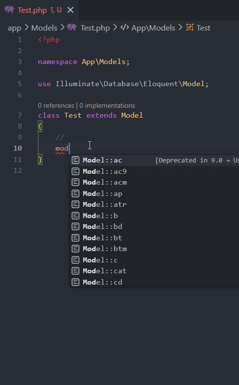

<p align="center">
    
</p>

<h1 align="center">Laravel Model Snippets</h1>

Version-aware Eloquent model snippets for VS Code, VS Codium, and compatible editors. Auto-detects Laravel version from `composer.json` and shows the right snippet pattern for your project.

[](https://marketplace.visualstudio.com/items?itemName=YasirArafat.laravel-eloquent-model-snippets)
[](https://open-vsx.org/extension/YasirArafat/laravel-eloquent-model-snippets)
[](LICENSE.md)

## Features

- **Version-aware**: Detects your Laravel version, shows only applicable snippets, badges deprecated ones with replacement hints.
- **82 snippets**: Everything from properties to polymorphic relations, pivot helpers, events, and change tracking.
- **No config needed**: Works out of the box. Override with `laravelModelSnippets.laravelVersion` setting.

## Compatibility

Works in **VS Code**, **VS Codium**, **Cursor**, **Windsurf**, and any editor compatible with VS Code extensions. The extension uses the standard VS Code extension API — no proprietary features.

## Usage

Type `Model::` in any PHP file and pick from the autocomplete list.

<p align="center">
    
</p>

### Properties & Config
```
Model::t    → protected $table
Model::pk   → protected $primaryKey
Model::ts   → public $timestamps
Model::df   → protected $dateFormat
Model::con  → protected $connection
Model::f    → protected $fillable
Model::g    → protected $guarded
Model::h    → protected $hidden
Model::v    → protected $visible
Model::ap   → protected $appends
Model::tc   → protected $touches
Model::i    → public $incrementing
Model::kt   → protected $keyType
Model::pp   → protected $perPage
Model::w    → protected $with
Model::atr  → protected $attributes
Model::cat  → const CREATED_AT
Model::uat  → const UPDATED_AT
Model::dat  → const DELETED_AT
Model::de   → $dispatchesEvents
```
### Casts & Accessors
```
Model::c    → $casts (deprecated 11+, use Model::cm)
Model::cm   → casts(): array (L11+)
Model::hsh  → 'hashed' cast
Model::enm  → AsEnumCollection::of() (L11+)
Model::ac   → getXAttribute() (deprecated 9+, use Model::ac9)
Model::mu   → setXAttribute() (deprecated 9+, use Model::mu9)
Model::ac9  → Attribute::make(get: ...) (L9+)
Model::mu9  → Attribute::make(set: ...) (L9+)
Model::acm  → Attribute::make(get+set) (L9+)
Model::d    → $dates (deprecated 10+, use datetime cast)
Model::sd   → serializeDate()
```
### Traits
```
Model::ff   → use HasFactory
Model::sft  → use SoftDeletes
Model::uid  → use HasUuids
Model::uld  → use HasUlids
```
### Methods: Boot, Scopes, Events
```
Model::b    → boot()
Model::bd   → booted() (L7+)
Model::s    → scopeX() local scope
Model::gs   → addGlobalScope() inline
Model::cr   → static::creating()
Model::cd   → static::created()
Model::sv   → static::saving()
Model::dl   → static::deleting()
Model::obs  → ::observe()
Model::we   → withoutEvents()
Model::tch  → touch()
```
### Relationships
```
Model::oo   → hasOne
Model::bt   → belongsTo
Model::om   → hasMany
Model::mm   → belongsToMany
Model::btm  → belongsToMany (alt)
Model::hmt  → hasManyThrough
Model::hot  → hasOneThrough
Model::mo   → morphOne
Model::mmo  → morphMany
Model::mt   → morphTo
Model::mtm  → morphToMany
Model::mbm  → morphedByMany
Model::hom  → hasOne()->ofMany() (L8+)
Model::wbt  → whereBelongsTo() (L8+)
```
### Pivot Helpers
```
Model::wp   → ->withPivot()
Model::pa   → ->as()
Model::pu   → ->using()
Model::pts  → ->withTimestamps()
Model::pwh  → ->wherePivot()
Model::pob  → ->orderByPivot()
```
### Change Tracking & Utility
```
Model::id   → isDirty()
Model::wc   → wasChanged()
Model::gor  → getOriginal()
Model::fsh  → fresh()
Model::rf   → refresh()
Model::rp   → replicate()
Model::sq   → saveQuietly() (L8+)
Model::mv   → makeVisible()
Model::mh   → makeHidden()
Model::is   → is() model comparison
Model::lc   → loadCount()
Model::ncl  → newCollection()
Model::pls  → preventLazyLoading()
Model::plp  → AppServiceProvider setup
Model::sbs  → shouldBeStrict() (L11+)
Model::rkr  → getRouteKeyName()
```

## Version Detection

Reads `require.laravel/framework` from `composer.json`. Override:

```json
"laravelModelSnippets.laravelVersion": "11.0"
```

## Requirements

VS Code / VS Codium 1.60+ (or any compatible editor).

## Acknowledgments

Inspired by [ahinkle/vscode-laravel-model-snippets](https://github.com/ahinkle/vscode-laravel-model-snippets) — I was a user of that extension. The original repository was archived by the owner on Dec 20, 2023 (read-only). Version-specific snippet suggestions were not available and the snippets were not kept up to date, so I created this extension with version-aware detection and modern Laravel support.

## License

MIT